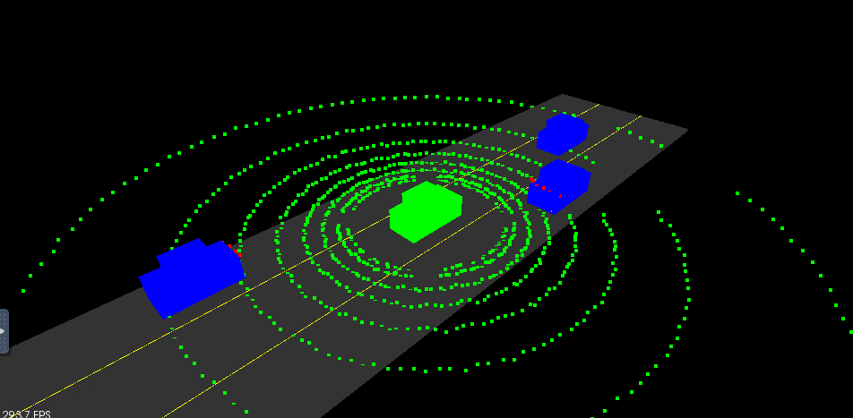
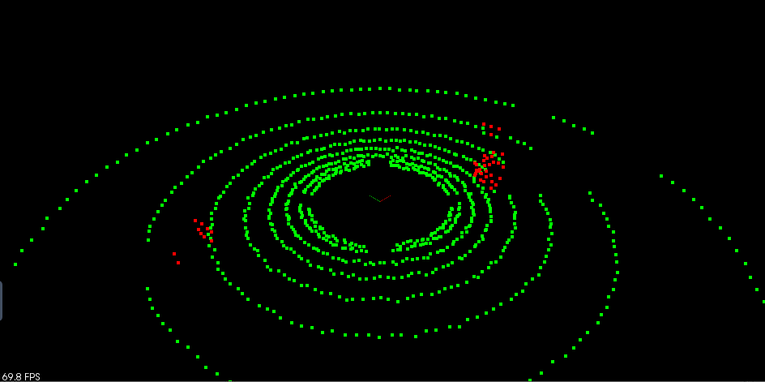

## LiDAR
- Lidar (light detection and ranging) is a sensor sending out beam of light and measures how long it takes for the beam of light to come back to determine the distance of the object.

- Lidar is a contraption consisting a laser, a method of deflection basically scanning that laser beam across the field of view. Containing a photo diode or a photo detector that detects the incoming photons that are reflected from the object. 

- The sensor sends out very short pulses (few nanoseconds), and then measures the time it takes for the pulse to go to the object and back to lidar where it's detected. This time gives the indication or gives the exact distance to that object. 

- The lidar scans across the field of view, which means you get each point in the field of view a distance to an object or no distance if there is no object there whatsoever. From this, it tells you exactly what objects there are, and how far away the are. 
- Power: Velodyne 32 POC uses 10 watts. The old Velodyne 64 uses 60 watt. If you have a laser in the 905 nanometer range, that uses 2 mili-watt. Laser in 1500 nanometer range, uses 10x more power, reach further and be as eye safe but more expensive. 
- Lidar is eye-safe means you can look into the lidar without hurting your eyes. Automotive lidar is class 1 that is eye safe.
- Here are the specs for a HDL 64 lidar. The lidar has 64 layers, where each layer is sent out at a different angle from the z axis, so different inclines. Each layer covers a 360 degree view and has an angular resolution of 0.08 degrees. On average the lidar scans ten times a second. The lidar can pick out objects up to 120M for cars and foliage, and can sense pavement up to 50M.

## LiDAR In Autonomous Vehicle
- Mount the LiDAR on the roof for the furthest field of view. But the roof lidar won't see anything that's happening close to the vehicle down more to the bottom. So, to fill out the the overall field of view of vehicle, mount lidar in front or back or the sides depends on where we want the overall gap of the coverage. 
- The relationship between the vertical field of view and the granularity: every layer in lidar has similar field of view but separate vertically. For example, a 16 layers lidar with 30 degree vertical field of view, there is a 2 degrees spacing between the layers in the image. 2 degrees in about 60 meters, you can hide pedestrian between 2 layers. This is the limitation of how far you can see the objects. 

## POINT CLOUDS
- Pointclodus (pc) are the set of all lidar reflections that are measured. Each point is one laser beam going to the object being reflected that created a point because the laser beam is relatively tight in diameter.
- Generate about 100MB/s roughly (more or less). Depends on how many laser and resolution in field of view. Example: 64 lasers/detector with 360 field of view, 0.08 degree resolution updating at 10hz will generate 64x(360/0.08)x10 points.
- Lidar data is stored in a format called Point Cloud Data (PCD). A PCD file is a list of (x,y,z,I) cartesian coordinates along with intensity values.
- The coordinate system for point cloud data is the same as the car’s local coordinate system. In this coordinate system the x axis is pointing towards the front of the car, and the y axis is pointing to the left of the car. Also since this coordinate system is right-handed the z axis points up above the car.

[insert image]

- Opensource Tools: [Point Cloud Library (PCL)](http://pointclouds.org/), OpenCV
    - PCL is widely used in the robotics community for working with point cloud data, and there are many tutorials available online for using it. There are a lot of built in functions in PCL that can help to detect obstacles. Built in PCL functions that will be used later in this module are Segmentation, Extraction, and Clustering.

### Process PointClouds Programming
- Use template function in order to process different pointcloud types since PCL pointclouds data type available in 2D, 3D, 3D with intensity, etc...
- `pcl::PointCloud<PointT>::Ptr` is a type. When using with template, requires using `typename` to avoid compilation error because the compiler assume template is a value by default.

### Excercise Codes Repo
https://github.com/ancabilloni/SFND_Lidar_Obstacle_Detection
### Exercise 1: Intro to Lidar and PointClouds
### Exercise 2: PointCloud Segmentation
- Planar Segmentation: to separate obstacle from non-obstacles in the scene with RANSAC (random sample consensus) algorithm.
  - Tutorial:[planar segmentation](http://pointclouds.org/documentation/tutorials/planar_segmentation.php#planar-segmentation)
  - Highlight codes:
  ```
    pcl::ModelCoefficients::Ptr coefficients (new pcl::ModelCoefficients);
    pcl::PointIndices::Ptr inliers (new pcl::PointIndices);
    // Create the segmentation object
    pcl::SACSegmentation<pcl::PointXYZ> seg;
    // Optional
    seg.setOptimizeCoefficients (true);
    // Mandatory
    seg.setModelType (pcl::SACMODEL_PLANE);
    seg.setMethodType (pcl::SAC_RANSAC);
    seg.setDistanceThreshold (0.01);

    seg.setInputCloud (cloud);
    seg.segment (*inliers, *coefficients);
  ```
  - distanceThreshold: how close the points must be to the model to be considered as inlier. 
- Separate Point Clouds: After getting inliers from Planner Segmentation. Obstacle and non-obstacle clouds can be separate with the `pcl::ExtractIndices`.
  - Tutorial: : [Extract Indices](http://pointclouds.org/documentation/tutorials/extract_indices.php#extract-indices)
  - Highlight codes:
  ```
  // Extract the inliers
    extract.setInputCloud (cloud_filtered);
    extract.setIndices (inliers);
    extract.setNegative (false);
    extract.filter (*cloud_p);
    std::cerr << "PointCloud representing the planar component: " << cloud_p->width * cloud_p->height << " data points." << std::endl;

    std::stringstream ss;
    ss << "table_scene_lms400_plane_" << i << ".pcd";
    writer.write<pcl::PointXYZ> (ss.str (), *cloud_p, false);

    // Create the filtering object
    extract.setNegative (true);
    extract.filter (*cloud_f);
  ```
  - With Scene

  - No Scene. Green clouds display non-obstacle (ground) and Red clouds display obstacles (vehicles).


- RANSAC
  - [Video](https://www.youtube.com/watch?time_continue=69&v=UD3LY0Btc58&feature=emb_logo)

### Why segment out the ground plan from pointclouds?
- To know the height above ground.
- Because the ground plan is the road, we can have knowledge if there is reflection of lane marking on the ground as separate objects.

### Do hills affect lidar?
- Yes, in term of field of view. Vehicle cannot see over the curve of the hill usually. However, there is the way to detect the slope. So in general, it's not quite about affecting the lidar but the environment the lidar sees.